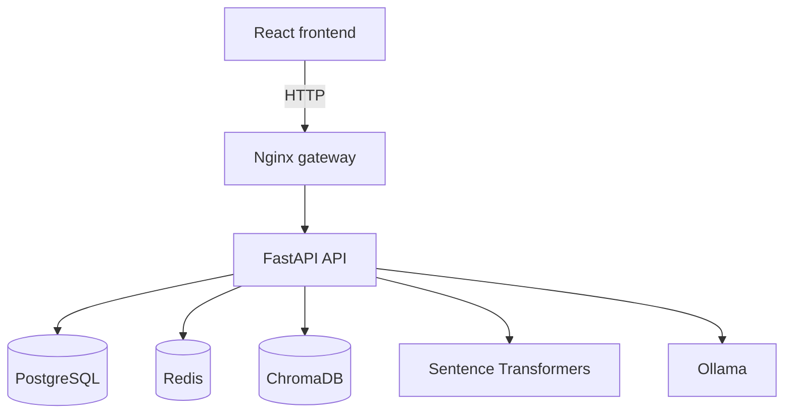

# Booking Platform

A containerized rental booking platform with a React frontend, FastAPI API, PostgreSQL persistence, Redis-backed coordination, and an authenticated AI assistant for rental documents and booking questions.

## Architecture



- **Frontend:** React, Vite, and TypeScript
- **Gateway:** Nginx on port 80
- **Backend:** FastAPI and Python 3.12
- **Database:** PostgreSQL, including booking date-range constraints and indexes
- **Coordination:** Redis for checkout locks and upload rate limiting
- **Vector store:** ChromaDB for document embeddings
- **Local LLM:** Ollama for agent routing and final answer generation

The compose file publishes the gateway on port 80 and the API directly on port 8000 for development. PostgreSQL, Redis, and ChromaDB remain available only on the Docker network.

## Booking Features

- Redis checkout locks and PostgreSQL transactions protect against concurrent double-bookings.
- PostgreSQL date-range queries provide efficient availability checks.
- Authenticated users can register, log in, browse properties, and create bookings.
- The API uses JWT authentication for protected booking, document, and assistant operations.

## AI and RAG Assistant

The `/rag/chat` endpoint is an agentic retrieval-augmented generation workflow. It uses the authenticated user as the security boundary and can combine uploaded documents with live booking and property data.

### Document ingestion

1. An authenticated user uploads a PDF or CSV through `/rag/documents`.
2. The API stores document metadata and processes the file in a background task.
3. PDFs are text-extracted page by page; CSV files are converted into row-based text chunks.
4. Chunks are embedded with `sentence-transformers/all-MiniLM-L6-v2` by default and stored in the `rental_documents` ChromaDB collection.
5. Each vector includes `user_id`, `document_id`, filename, and page or row metadata.
6. The document is marked `READY` only after processing and vector storage succeed.

PDFs are limited to 50 pages and 200 chunks by default. CSV files are limited to 1,000 rows and 200 chunks. Uploads default to 5 MB and 5 files per user per day. These values can be changed with the environment variables listed below.

### Agent workflow

The agent performs three phases:

1. **Route:** Ollama returns a structured intent and optional tool call.
2. **Execute:** The selected tool gathers only the data available to the authenticated user.
3. **Generate:** Ollama produces the final answer and maps document source IDs back to page or row citations.

Available tools are:

| Tool | Purpose |
|---|---|
| `search_documents` | Semantic search over the current user's ready documents |
| `get_user_bookings` | Retrieve the current user's recent bookings |
| `get_booking` | Retrieve one booking after verifying it belongs to the current user |
| `get_property` | Search the property catalog by name or location |

Questions routed as unrelated are declined. Conversational follow-ups can be reformulated with recent chat history, and document-related follow-ups have a deterministic routing fallback.

### RAG endpoints

All endpoints require a bearer token except `/rag/health`.

| Method | Endpoint | Description |
|---|---|---|
| `GET` | `/api/rag/health` | Check embedding model and ChromaDB availability |
| `POST` | `/api/rag/documents` | Upload one PDF or CSV document |
| `GET` | `/api/rag/documents` | List the current user's documents and processing status |
| `DELETE` | `/api/rag/documents/{document_id}` | Delete document metadata and its vectors |
| `POST` | `/api/rag/chat` | Ask the AI assistant a question |

Example chat request:

```bash
curl -X POST http://localhost/api/rag/chat \
    -H "Authorization: Bearer $TOKEN" \
    -H "Content-Type: application/json" \
    -d '{"question":"What is the cancellation policy?","history":[]}'
```

The response contains an `answer` and a `sources` array. Sources identify the document, filename, and page or CSV row used in the answer.

### AI configuration

The API requires these variables for chat:

```dotenv
OLLAMA_BASE_URL=http://host.docker.internal:11434
OLLAMA_MODEL=qwen2.5:3b
```

Run Ollama on the host and pull the configured model before using `/api/rag/chat`:

```bash
ollama pull qwen2.5:3b
```

Optional RAG settings:

```dotenv
RAG_EMBEDDING_MODEL=sentence-transformers/all-MiniLM-L6-v2
MAX_UPLOAD_SIZE_MB=5
FREE_UPLOADS_PER_DAY=5
MAX_PDF_PAGES=50
MAX_CHUNKS=200
MAX_CSV_ROWS=1000
```

User isolation is enforced in both PostgreSQL document selection and ChromaDB metadata filters. Deleting a document removes its database record and attempts to remove all vectors for that user and document.

## Getting Started

### Prerequisites

- Docker Desktop with Docker Compose
- GNU Make, or the equivalent Docker Compose commands
- Ollama installed on the host for AI chat

Create a root `.env` file with the database, Redis, JWT, and other application secrets expected by `docker-compose.yml`, then configure the Ollama variables above. The repository does not currently include an `.env.sample` file.

### Run the stack

```bash
make build
make up
```

- Frontend: `http://localhost`
- API gateway: `http://localhost/api/`
- FastAPI docs in development mode: `http://localhost/api/docs`

In the default production environment, the API disables its OpenAPI and ReDoc endpoints.

### Make commands

| Command | Description |
|---|---|
| `make build` | Build the frontend and backend images |
| `make up` | Start the stack in detached mode |
| `make down` | Stop and remove containers |
| `make logs` | Follow compose logs |
| `make clean` | Stop containers and remove volumes, including database and vectors |
| `make dev` | Rebuild and start the stack |
| `make all_dev` | Remove volumes, rebuild, and start the stack |
| `make concurrency-test` | Run the booking concurrency script inside the API container |
| `make prune` | Remove unused Docker data |

## Testing

Run the backend tests inside the API container:

```bash
docker compose exec api pytest
```

The concurrency test can be run with:

```bash
make concurrency-test
```
