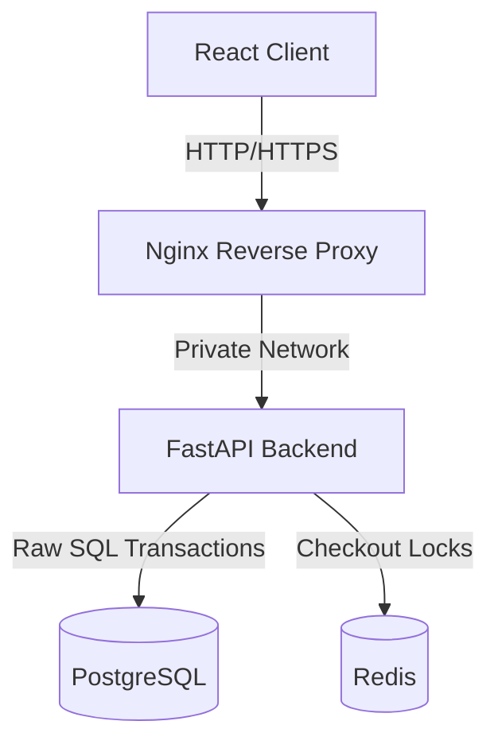

# ft_rental_architecture (Booking Platform)

A highly resilient, distributed booking engine and event-driven rental platform built to withstand high concurrency and prevent double-booking race conditions.

## 🏗️ Architecture Overview

The platform uses a modern microservices architecture, fully containerized and orchestrated via Docker Compose.

- **Frontend:** React (Vite, TypeScript, TailwindCSS)
- **Reverse Proxy:** Nginx (The only publicly exposed service)
- **Backend:** FastAPI (Python)
- **Database:** PostgreSQL (with GiST indexing for dateranges)
- **Cache & Concurrency:** Redis



## ✨ Key Features & Defense Mechanisms

1. **Zero Double-Bookings:** Uses Redis for fast, expiring checkout locks (`SET NX EX`) and PostgreSQL `FOR UPDATE` row-level locks for atomic, ACID-compliant booking transactions.
2. **High-Performance Overlap Queries:** Uses native PostgreSQL `daterange` types combined with a composite GiST index to calculate availability instantly without scanning rows.
3. **Strict Network Security:** The backend, database, and Redis containers have **no published ports**. Every external request—including webhooks—must pass through Nginx.
4. **Idempotent Webhooks:** Payment confirmations via Stripe are handled server-side, verifying webhook signatures and strictly enforcing idempotency to prevent duplicate side-effects.
5. **Data Integrity:** Strict Kernel-level constraints (`CHECK`) ensure valid status flows and prevent empty bookings at the database level.

## 🚀 Getting Started

This project includes a wrapper `Makefile` so you can manage the entire stack without memorizing raw `docker-compose` commands.

### Prerequisites
- Docker & Docker Compose
- Make

### Environment Variables
Copy the `.env.sample` file to `.env` and fill in your secrets (e.g., Database credentials, Stripe API keys, Redis passwords).
```bash
cp .env.sample .env
```

### Make Commands Reference

| Command | Description |
|---|---|
| `make build` | Build all Docker images (frontend, backend, db, etc.) |
| `make up` | Start all containers in detached mode |
| `make down` | Stop and remove all containers |
| `make logs` | Follow the backend container logs |
| `make test` | Run the full test suite |
| `make concurrency-test` | Run the 50-request concurrency test (validates race condition prevention) |
| `make seed` | Seed the database with 100k+ rows for performance testing |
| `make clean` | Stop containers and remove volumes (wipes database) |
| `make restart` | Runs `down` followed by `up` |

### Running the Project
```bash
make build
make up
```
- **Frontend UI:** `http://localhost` (Served via Nginx)
- **Backend API Docs:** `http://localhost/docs` (Routed via Nginx to FastAPI)

## 🧪 Testing Concurrency

To prove that the architecture prevents race conditions under load, run the mandatory concurrency test:
```bash
make concurrency-test
```
This script fires 50 simultaneous checkout requests at the exact same asset for overlapping dates. The test asserts that exactly **one** request succeeds, and the other 49 receive a clean `409 Conflict` response.
